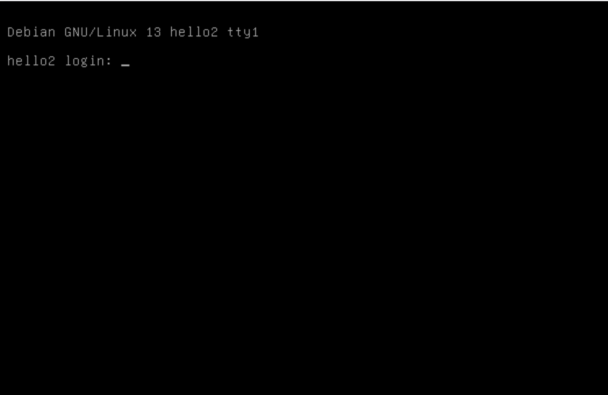

# Task 1 - Server creation

## Follow Figure 1007, “Your first server ” and create a server. Then access it:

1. By ssh i.e.;

         ssh root@95.216.187.60

   You'll see something like:

        The authenticity of host '37.27.32.138 (37.27.32.138)' can't be established.
        ED25519 key fingerprint is SHA256:vMMi2lkyhu0BPeqfncLzDRo6a1Ae8TtyVETebvh2ZwU.
        This key is not known by any other names.
        Are you sure you want to continue connecting (yes/no/[fingerprint])?

   Explain this message's meaning.

   **Explanation:** The client stores fingerprints and IP addresses of the server it connects to. In this case our
   device has no entry
   for the given server. The client is asking us to confirm that the server is the one we expect to connect to. If we
   say "yes", the client will store the server's fingerprint and IP address for future reference. If we say "no", the
   connection will be aborted. If the fingerprint is already given the user can specify its path through the "
   fingerprint" option. This is because of security reasons. If the server's fingerprint changes unexpectedly, it could
   indicate a potential security breach, such as a man-in-the-middle attack. By asking the user to confirm the
   authenticity of the server, SSH helps to prevent unauthorized access and ensures that the user is connecting to the
   intended server.

2. By Hetzner's server GUI. Top right next to »Actions«.

   

   When trying to log in to the server through the hetzner console, you will be asked to enter the username and the
   password for the server.

