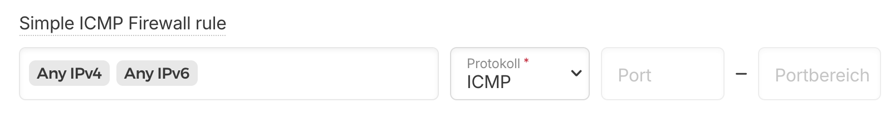
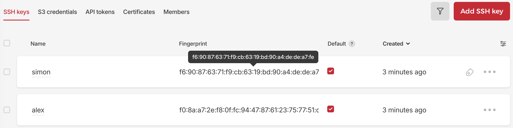

# Task 3 - Improve your server's security!

Re-create your server solving (some of) its security flaws.

1. Create a firewall using the Hetzner GUI containing just a single ICMP inbound access rule.

   

2. Transfer your public ssh key to your Hetzner account marking it as “default”.

   

3. Select both your newly created firewall and your ssh key during server creation. The subsequent examples assumes a
   167.235.54.109 server IP.

4. Try to ping your server:

        $ ping 167.235.54.109
        PING 167.235.54.109 (167.235.54.109) 56(84) bytes of data.
        64 bytes from 167.235.54.109: icmp_seq=1 ttl=54 time=13.2 ms
        64 bytes from 167.235.54.109: icmp_seq=2 ttl=54 time=12.3 ms
        ^C
        --- 167.235.54.109 ping statistics ---
        2 packets transmitted, 2 received, 0% packet loss, time 1001ms
        rtt min/avg/max/mdev = 12.325/12.749/13.173/0.424 ms

5. Due to your firewall rule ssh access should fail.

6. Add an inbound rule to port 22 (ssh standard port) to your current firewall. ssh password less access should now
   work:

        $ ssh root@167.235.54.109
        Linux gtest3 6.1.0-21-amd64 #1 SMP PREEMPT_DYNAMIC Debian 6.1.90-1 (2024-05-03) x86_64
            ...
        root@gtest3:~# hostname
        gtest3

7. Update and reboot your server:

         root@gtest3:~# apt update
         Get:1 http://mirror.hetzner.com/debian/packages bookworm InRelease [151 kB]
         Get:2 http://deb.debian.org/debian bookworm
         InRelease [151 kB]                                                        
         Get:3 http://deb.debian.org/debian bookworm-updates InRelease [55.4 kB]
         ...
         root@gtest3:~# apt upgrade  
         ...
         root@gtest3:~# aptitude -y upgrade
         Resolving dependencies...                
         The following NEW packages will be installed:
         linux-image-6.1.0-32-amd64{a}
         The following packages will be upgraded:
         base-files curl libc-bin libc-l10n libc6 libcurl3-gnutls libcurl4 libfreetype6 liblzma5 libnss-systemd libpam-systemd
         libsystemd-shared libsystemd0 libudev1 linux-image-amd64 locales locales-all python3-jinja2
         systemd systemd-sysv systemd-timesyncd tzdata udev vim vim-common vim-runtime vim-tiny wget xz-utils
         ...
         root@gtest3:~# reboot

8. Install the nginx webserver:

        root@gtest3:~# apt install nginx
        Reading package lists... Done
        Building dependency tree... Done
        ...
        Do you want to continue? [Y/n] y
        Get:1 http://deb.debian.org/debian bookworm/main amd64 nginx-common all 1.22.1-9 [112 kB]
        Get:2 http://deb.debian.org/debian bookworm/main amd64 nginx amd64 1.22.1-9 [527 kB]
        ...
        Processing triggers for man-db (2.11.2-2) ...

   Check for the running process:

        root@gtest3:~# systemctl status nginx
        ● nginx.service - A high performance web server and a reverse proxy server
             Loaded: loaded (/lib/systemd/system/nginx.service; enabled; preset: enabled)
             Active: active (running) since Tue 2024-06-04 08:24:57 UTC; 1min 31s ago
               Docs: man:nginx(8)
            Process: 1558 ExecStartPre=/usr/sbin/nginx -t -q -g daemon on; master_process on; (code=exited, status=0/SUCCESS)
            Process: 1559 ExecStart=/usr/sbin/nginx -g daemon on; master_process on; (code=exited, status=0/SUCCESS)
           Main PID: 1582 (nginx)
              Tasks: 2 (limit: 2251)
             Memory: 1.8M
                CPU: 22ms
             CGroup: /system.slice/nginx.service
                     ├─1582 "nginx: master process /usr/sbin/nginx -g daemon on; master_process on;"
                     └─1583 "nginx: worker process"

9. Use wget for locally accessing http://167.235.54.109 verifying HTTP (port 80) accessibility from your server:

        #ssh root@167.235.54.109
        root@gtest3:~# wget -O - http://167.235.54.109
        --2024-06-04 09:02:41--  http://167.235.54.109/
        Connecting to 167.235.54.109:80... connected.
        HTTP request sent, awaiting response... 200 OK
        Length: 615 [text/html]
        Saving to: ‘STDOUT’
    
        <html>
        <head>
        <title>Welcome to nginx!</title>
                    ...
        
<em>Thank you for using nginx.</em>

        </body>
        </html>

10. Try external access using http://167.235.54.109 again in your browser of choice.

    Why does external access fail although local access to the server works?

11. Modify your firewall adding an inbound HTTP traffic rule. Then again try accessing http://167.235.54.109 in your
    browser.

